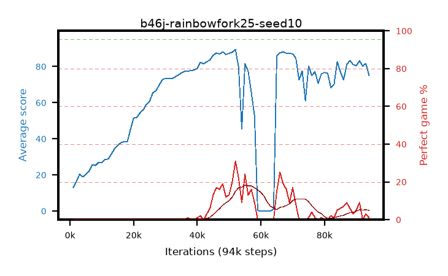

# b46j-rainbowfork25-seed10

step **94,000** · 94 evals · trailing **78.94** · peak **78.94** @94,000 · sef **0.0** · best30 **11.7** @71,000

## Config

| | |
|---|---|
| adam_epsilon | 1e-07 |
| algo | rainbow |
| batch_size | 32 |
| beta_anneal_steps | 300000 |
| btr_blocks | 3 |
| btr_layer_norm | False |
| btr_residual | False |
| btr_spectral_norm | True |
| collect_envs | 1 |
| discount | 0.99 |
| dist_atoms | 51 |
| dist_embedding | 64 |
| dist_kappa | 1.0 |
| dist_policy_samples | 8 |
| dist_quantiles | 32 |
| dist_tau_prime_samples | 8 |
| dist_tau_samples | 8 |
| dist_v_max | 110.0 |
| dist_v_min | -10.0 |
| epsilon_anneal_steps | 1 |
| epsilon_schedule | eval |
| eval_interval | 1000 |
| eval_queue | True |
| eval_queue_depth | 16 |
| eval_workers | 8 |
| fc_layers | (320,) |
| fork_branches | 4 |
| fork_max_steps | 60 |
| fork_min_length | 85 |
| fork_prob | 0.5 |
| gradient_clipping | 0.0 |
| graph_eval_episodes | 100 |
| guided_fraction | 0.8 |
| init_from | None |
| initial_collect_steps | 2000 |
| initial_epsilon | 0.4 |
| is_beta | 0.4 |
| is_beta_final | 1.0 |
| is_normalization | mean |
| is_weights | True |
| learning_rate | 1e-05 |
| max_steps | 3000000 |
| min_checkpoint_score | 40.0 |
| min_epsilon | 0.002 |
| munchausen_alpha | 0.0 |
| munchausen_l0 | -1.0 |
| munchausen_tau | 0.03 |
| n_step_update | 3 |
| priority_exponent | 0.6 |
| rainbow_double | True |
| rainbow_dueling | True |
| rainbow_epsilon_decay | linear |
| rainbow_epsilon_zero_at | 0.0 |
| rainbow_head | c51 |
| rainbow_munchausen_logpi | target |
| rainbow_noisy | True |
| rainbow_noisy_sigma | 0.5 |
| rainbow_prefill_epsilon | random |
| rainbow_stream_width | 512 |
| replay_buffer_max_length | 100000 |
| replay_ratio | 0.25 |
| reset_alpha | 0.5 |
| reset_anneal_gamma |  |
| reset_anneal_n_step |  |
| reset_anneal_steps | 10000 |
| reset_interval | 0 |
| reset_stop_after | 0 |
| seed | 10 |
| target_update_period | 8 |
| target_update_tau | 1.0 |
| torch_threads | 1 |

## Evals

| step | avg score | trailing avg | min score | max score | avg reward | perfect % | epsilon |
|---|---|---|---|---|---|---|---|
| 1000 | 13.06 | 13.06 | 0.0 | 57.0 | 11.935 | 0.0 | 0.4 |
| 2000 | 16.34 | 14.7 | 0.0 | 49.0 | 13.541 | 0.0 | 0.4 |
| 3000 | 20.32 | 16.57 | 0.0 | 47.0 | 15.629 | 0.0 | 0.4 |
| ... | ... | ... | ... | ... | ... | ... | ... |
| 83000 | 70.03 | 60.46 | 0.0 | 95.0 | 69.752 | 1.0 | 0.01006 |
| 84000 | 82.7 | 61.55 | 2.0 | 95.0 | 86.3 | 5.0 | 0.01015 |
| 85000 | 76.99 | 61.51 | 0.0 | 95.0 | 81.614 | 6.0 | 0.01025 |
| 86000 | 72.61 | 61.39 | 0.0 | 95.0 | 78.332 | 7.0 | 0.01064 |
| 87000 | 81.07 | 61.9 | 0.0 | 95.0 | 88.713 | 9.0 | 0.01064 |
| 88000 | 83.34 | 65.62 | 1.0 | 95.0 | 87.894 | 6.0 | 0.01081 |
| 89000 | 81.1 | 62.85 | 42.0 | 95.0 | 82.522 | 3.0 | 0.01084 |
| 90000 | 80.38 | 68.3 | 46.0 | 95.0 | 83.505 | 5.0 | 0.01105 |
| 91000 | 83.21 | 71.07 | 46.0 | 95.0 | 90.075 | 9.0 | 0.01105 |
| 92000 | 80.24 | 73.75 | 2.0 | 94.0 | 78.391 | 0.0 | 0.01116 |
| 93000 | 81.69 | 76.47 | 56.0 | 95.0 | 82.377 | 3.0 | 0.0111 |
| 94000 | 75.18 | 78.94 | 36.0 | 95.0 | 72.043 | 1.0 | 0.0111 |
