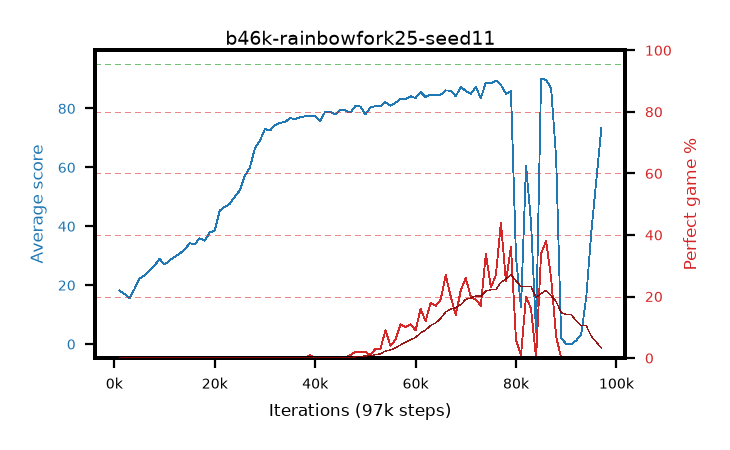

# b46k-rainbowfork25-seed11

step **97,000** · 96 evals · trailing **57.9** · peak **84.45** @79,000 · sef **0.0** · best30 **20.2** @87,000

## Config

| | |
|---|---|
| adam_epsilon | 1e-07 |
| algo | rainbow |
| batch_size | 32 |
| beta_anneal_steps | 300000 |
| btr_blocks | 3 |
| btr_layer_norm | False |
| btr_residual | False |
| btr_spectral_norm | True |
| collect_envs | 1 |
| discount | 0.99 |
| dist_atoms | 51 |
| dist_embedding | 64 |
| dist_kappa | 1.0 |
| dist_policy_samples | 8 |
| dist_quantiles | 32 |
| dist_tau_prime_samples | 8 |
| dist_tau_samples | 8 |
| dist_v_max | 110.0 |
| dist_v_min | -10.0 |
| epsilon_anneal_steps | 1 |
| epsilon_schedule | eval |
| eval_interval | 1000 |
| eval_queue | True |
| eval_queue_depth | 16 |
| eval_workers | 8 |
| fc_layers | (320,) |
| fork_branches | 4 |
| fork_max_steps | 60 |
| fork_min_length | 85 |
| fork_prob | 0.5 |
| gradient_clipping | 0.0 |
| graph_eval_episodes | 100 |
| guided_fraction | 0.8 |
| init_from | None |
| initial_collect_steps | 2000 |
| initial_epsilon | 0.4 |
| is_beta | 0.4 |
| is_beta_final | 1.0 |
| is_normalization | mean |
| is_weights | True |
| learning_rate | 1e-05 |
| max_steps | 3000000 |
| min_checkpoint_score | 40.0 |
| min_epsilon | 0.002 |
| munchausen_alpha | 0.0 |
| munchausen_l0 | -1.0 |
| munchausen_tau | 0.03 |
| n_step_update | 3 |
| priority_exponent | 0.6 |
| rainbow_double | True |
| rainbow_dueling | True |
| rainbow_epsilon_decay | linear |
| rainbow_epsilon_zero_at | 0.0 |
| rainbow_head | c51 |
| rainbow_munchausen_logpi | target |
| rainbow_noisy | True |
| rainbow_noisy_sigma | 0.5 |
| rainbow_prefill_epsilon | random |
| rainbow_stream_width | 512 |
| replay_buffer_max_length | 100000 |
| replay_ratio | 0.25 |
| reset_alpha | 0.5 |
| reset_anneal_gamma |  |
| reset_anneal_n_step |  |
| reset_anneal_steps | 10000 |
| reset_interval | 0 |
| reset_stop_after | 0 |
| seed | 11 |
| target_update_period | 8 |
| target_update_tau | 1.0 |
| torch_threads | 1 |

## Evals

| step | avg score | trailing avg | min score | max score | avg reward | perfect % | epsilon |
|---|---|---|---|---|---|---|---|
| 1000 | 18.23 | 18.23 | 0.0 | 36.0 | 13.567 | 0.0 | 0.4 |
| 2000 | 17.08 | 17.66 | 1.0 | 38.0 | 12.259 | 0.0 | 0.4 |
| 3000 | 15.55 | 16.95 | 3.0 | 33.0 | 10.831 | 0.0 | 0.05 |
| ... | ... | ... | ... | ... | ... | ... | ... |
| 85000 | 90.2 | 76.29 | 48.0 | 95.0 | 122.774 | 34.0 | 0.00847 |
| 86000 | 89.64 | 76.54 | 46.0 | 95.0 | 126.229 | 38.0 | 0.00847 |
| 87000 | 86.92 | 73.97 | 20.0 | 95.0 | 111.178 | 26.0 | 0.00834 |
| 88000 | 63.16 | 67.63 | 2.0 | 95.0 | 67.509 | 7.0 | 0.00834 |
| 89000 | 2.14 | 73.84 | 0.0 | 9.0 | 1.442 | 0.0 | 0.00834 |
| 90000 | 0.0 | 71.16 | 0.0 | 0.0 | -0.55 | 0.0 | 0.00795 |
| 91000 | 0.0 | 68.38 | 0.0 | 0.0 | -0.55 | 0.0 | 0.00802 |
| 92000 | 1.22 | 64.88 | 0.0 | 6.0 | 0.659 | 0.0 | 0.00799 |
| 93000 | 3.4 | 62.16 | 0.0 | 20.0 | 2.812 | 0.0 | 0.00805 |
| 94000 | 16.06 | 59.88 | 0.0 | 65.0 | 14.679 | 0.0 | 0.05 |
| 95000 | 38.07 | 58.33 | 3.0 | 79.0 | 36.188 | 0.0 | 0.05 |
| 97000 | 73.28 | 57.9 | 18.0 | 89.0 | 71.389 | 0.0 | 0.4 |
