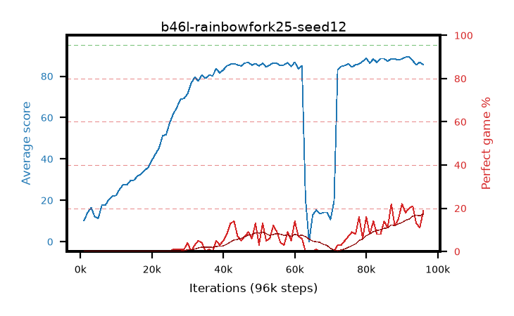

# b46l-rainbowfork25-seed12

step **96,000** · 96 evals · trailing **74.82** · peak **84.3** @62,000 · sef **0.0** · best30 **10.3** @96,000

## Config

| | |
|---|---|
| adam_epsilon | 1e-07 |
| algo | rainbow |
| batch_size | 32 |
| beta_anneal_steps | 300000 |
| btr_blocks | 3 |
| btr_layer_norm | False |
| btr_residual | False |
| btr_spectral_norm | True |
| collect_envs | 1 |
| discount | 0.99 |
| dist_atoms | 51 |
| dist_embedding | 64 |
| dist_kappa | 1.0 |
| dist_policy_samples | 8 |
| dist_quantiles | 32 |
| dist_tau_prime_samples | 8 |
| dist_tau_samples | 8 |
| dist_v_max | 110.0 |
| dist_v_min | -10.0 |
| epsilon_anneal_steps | 1 |
| epsilon_schedule | eval |
| eval_interval | 1000 |
| eval_queue | True |
| eval_queue_depth | 16 |
| eval_workers | 8 |
| fc_layers | (320,) |
| fork_branches | 4 |
| fork_max_steps | 60 |
| fork_min_length | 85 |
| fork_prob | 0.5 |
| gradient_clipping | 0.0 |
| graph_eval_episodes | 100 |
| guided_fraction | 0.8 |
| init_from | None |
| initial_collect_steps | 2000 |
| initial_epsilon | 0.4 |
| is_beta | 0.4 |
| is_beta_final | 1.0 |
| is_normalization | mean |
| is_weights | True |
| learning_rate | 1e-05 |
| max_steps | 3000000 |
| min_checkpoint_score | 40.0 |
| min_epsilon | 0.002 |
| munchausen_alpha | 0.0 |
| munchausen_l0 | -1.0 |
| munchausen_tau | 0.03 |
| n_step_update | 3 |
| priority_exponent | 0.6 |
| rainbow_double | True |
| rainbow_dueling | True |
| rainbow_epsilon_decay | linear |
| rainbow_epsilon_zero_at | 0.0 |
| rainbow_head | c51 |
| rainbow_munchausen_logpi | target |
| rainbow_noisy | True |
| rainbow_noisy_sigma | 0.5 |
| rainbow_prefill_epsilon | random |
| rainbow_stream_width | 512 |
| replay_buffer_max_length | 100000 |
| replay_ratio | 0.25 |
| reset_alpha | 0.5 |
| reset_anneal_gamma |  |
| reset_anneal_n_step |  |
| reset_anneal_steps | 10000 |
| reset_interval | 0 |
| reset_stop_after | 0 |
| seed | 12 |
| target_update_period | 8 |
| target_update_tau | 1.0 |
| torch_threads | 1 |

## Evals

| step | avg score | trailing avg | min score | max score | avg reward | perfect % | epsilon |
|---|---|---|---|---|---|---|---|
| 1000 | 10.21 | 10.21 | 0.0 | 22.0 | 7.416 | 0.0 | 0.4 |
| 2000 | 14.04 | 12.12 | 6.0 | 23.0 | 10.253 | 0.0 | 0.4 |
| 3000 | 16.46 | 13.57 | 4.0 | 27.0 | 11.698 | 0.0 | 0.1 |
| ... | ... | ... | ... | ... | ... | ... | ... |
| 85000 | 88.51 | 64.23 | 26.0 | 95.0 | 101.038 | 14.0 | 0.01105 |
| 86000 | 87.25 | 64.31 | 2.0 | 95.0 | 96.813 | 11.0 | 0.01105 |
| 87000 | 88.43 | 64.41 | 26.0 | 95.0 | 108.997 | 22.0 | 0.01097 |
| 88000 | 88.31 | 64.46 | 70.0 | 95.0 | 98.884 | 12.0 | 0.01095 |
| 89000 | 87.78 | 64.57 | 2.0 | 95.0 | 101.364 | 15.0 | 0.01094 |
| 90000 | 88.34 | 64.62 | 35.0 | 95.0 | 108.922 | 22.0 | 0.01094 |
| 91000 | 89.19 | 64.8 | 46.0 | 95.0 | 105.78 | 18.0 | 0.01073 |
| 92000 | 89.25 | 64.94 | 56.0 | 95.0 | 107.803 | 20.0 | 0.01071 |
| 93000 | 87.55 | 70.01 | 1.0 | 95.0 | 107.12 | 21.0 | 0.01062 |
| 94000 | 85.44 | 67.1 | 40.0 | 95.0 | 97.05 | 13.0 | 0.01062 |
| 95000 | 86.79 | 72.48 | 50.0 | 95.0 | 96.419 | 11.0 | 0.01047 |
| 96000 | 85.52 | 74.82 | 30.0 | 95.0 | 103.131 | 19.0 | 0.01036 |
