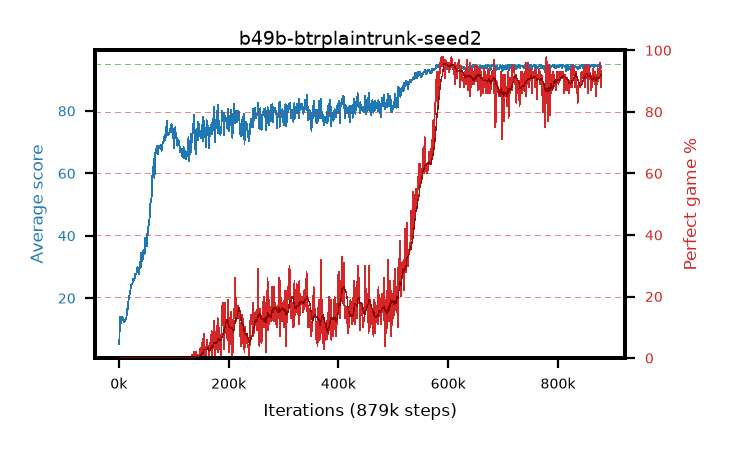

# b49b-btrplaintrunk-seed2

step **879,000** · 879 evals · trailing **94.46** · peak **94.51** @876,000 · sef **33.7** · best30 **95.0** @613,000

## Config

| | |
|---|---|
| adam_epsilon | 1.953125e-05 |
| algo | btr |
| batch_size | 256 |
| beta_anneal_steps | 1 |
| btr_blocks | 3 |
| btr_layer_norm | False |
| btr_residual | False |
| btr_spectral_norm | True |
| collect_envs | 64 |
| discount | 0.997 |
| dist_atoms | 51 |
| dist_embedding | 64 |
| dist_kappa | 1.0 |
| dist_policy_samples | 8 |
| dist_quantiles | 32 |
| dist_tau_prime_samples | 8 |
| dist_tau_samples | 8 |
| dist_v_max | 110.0 |
| dist_v_min | -10.0 |
| epsilon_anneal_steps | 2000000 |
| epsilon_schedule | linear |
| eval_interval | 1000 |
| eval_queue | True |
| eval_queue_depth | 16 |
| eval_workers | 8 |
| fc_layers | (320,) |
| fork_branches | 1 |
| gradient_clipping | 10.0 |
| graph_eval_episodes | 100 |
| guided_fraction | 0.0 |
| init_from | None |
| initial_collect_steps | 200000 |
| initial_epsilon | 1.0 |
| is_beta | 0.2 |
| is_beta_final | 0.2 |
| is_normalization | batch_max |
| is_weights | True |
| learning_rate | 0.0001 |
| max_steps | 1000000 |
| min_checkpoint_score | 40.0 |
| min_epsilon | 0.01 |
| munchausen_alpha | 0.9 |
| munchausen_l0 | -1.0 |
| munchausen_tau | 0.03 |
| n_step_update | 3 |
| priority_exponent | 0.2 |
| rainbow_double | False |
| rainbow_dueling | True |
| rainbow_epsilon_decay | geometric |
| rainbow_epsilon_zero_at | 0.5 |
| rainbow_head | iqn |
| rainbow_munchausen_logpi | online |
| rainbow_noisy | True |
| rainbow_noisy_sigma | 0.5 |
| rainbow_prefill_epsilon | schedule |
| rainbow_stream_width | 512 |
| replay_buffer_max_length | 1048576 |
| replay_ratio | 0.015625 |
| reset_alpha | 0.5 |
| reset_anneal_gamma |  |
| reset_anneal_n_step |  |
| reset_anneal_steps | 10000 |
| reset_interval | 0 |
| reset_stop_after | 0 |
| seed | 2 |
| target_update_period | 500 |
| target_update_tau | 1.0 |
| torch_threads | 1 |

## Evals

| step | avg score | trailing avg | min score | max score | avg reward | perfect % | epsilon |
|---|---|---|---|---|---|---|---|
| 1000 | 5.28 | 5.28 | 0.0 | 30.0 | 4.222 | 0.0 | 0.8776 |
| 2000 | 14.01 | 9.64 | 1.0 | 22.0 | 9.052 | 0.0 | 0.85028 |
| 3000 | 11.78 | 10.36 | 2.0 | 26.0 | 6.716 | 0.0 | 0.82381 |
| ... | ... | ... | ... | ... | ... | ... | ... |
| 868000 | 94.45 | 94.46 | 79.0 | 95.0 | 182.627 | 90.0 | 0.0 |
| 869000 | 94.28 | 94.46 | 77.0 | 95.0 | 177.232 | 85.0 | 0.0 |
| 870000 | 94.5 | 94.49 | 83.0 | 95.0 | 183.736 | 91.0 | 0.0 |
| 871000 | 94.59 | 94.49 | 83.0 | 95.0 | 184.851 | 92.0 | 0.0 |
| 872000 | 94.08 | 94.48 | 47.0 | 95.0 | 181.201 | 89.0 | 0.0 |
| 873000 | 94.85 | 94.49 | 91.0 | 95.0 | 187.215 | 94.0 | 0.0 |
| 874000 | 94.83 | 94.49 | 92.0 | 95.0 | 187.171 | 94.0 | 0.0 |
| 875000 | 94.21 | 94.48 | 42.0 | 95.0 | 184.508 | 92.0 | 0.0 |
| 876000 | 94.59 | 94.51 | 84.0 | 95.0 | 186.945 | 94.0 | 0.0 |
| 877000 | 94.0 | 94.49 | 10.0 | 95.0 | 188.483 | 96.0 | 0.0 |
| 878000 | 94.64 | 94.49 | 86.0 | 95.0 | 184.906 | 92.0 | 0.0 |
| 879000 | 93.74 | 94.46 | 38.0 | 95.0 | 179.893 | 88.0 | 0.0 |
