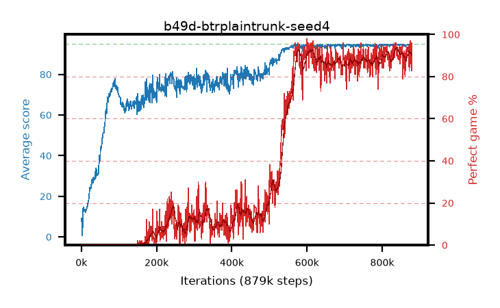

# b49d-btrplaintrunk-seed4

step **879,000** · 879 evals · trailing **94.46** · peak **94.62** @853,000 · sef **34.6** · best30 **92.0** @853,000

## Config

| | |
|---|---|
| adam_epsilon | 1.953125e-05 |
| algo | btr |
| batch_size | 256 |
| beta_anneal_steps | 1 |
| btr_blocks | 3 |
| btr_layer_norm | False |
| btr_residual | False |
| btr_spectral_norm | True |
| collect_envs | 64 |
| discount | 0.997 |
| dist_atoms | 51 |
| dist_embedding | 64 |
| dist_kappa | 1.0 |
| dist_policy_samples | 8 |
| dist_quantiles | 32 |
| dist_tau_prime_samples | 8 |
| dist_tau_samples | 8 |
| dist_v_max | 110.0 |
| dist_v_min | -10.0 |
| epsilon_anneal_steps | 2000000 |
| epsilon_schedule | linear |
| eval_interval | 1000 |
| eval_queue | True |
| eval_queue_depth | 16 |
| eval_workers | 8 |
| fc_layers | (320,) |
| fork_branches | 1 |
| gradient_clipping | 10.0 |
| graph_eval_episodes | 100 |
| guided_fraction | 0.0 |
| init_from | None |
| initial_collect_steps | 200000 |
| initial_epsilon | 1.0 |
| is_beta | 0.2 |
| is_beta_final | 0.2 |
| is_normalization | batch_max |
| is_weights | True |
| learning_rate | 0.0001 |
| max_steps | 1000000 |
| min_checkpoint_score | 40.0 |
| min_epsilon | 0.01 |
| munchausen_alpha | 0.9 |
| munchausen_l0 | -1.0 |
| munchausen_tau | 0.03 |
| n_step_update | 3 |
| priority_exponent | 0.2 |
| rainbow_double | False |
| rainbow_dueling | True |
| rainbow_epsilon_decay | geometric |
| rainbow_epsilon_zero_at | 0.5 |
| rainbow_head | iqn |
| rainbow_munchausen_logpi | online |
| rainbow_noisy | True |
| rainbow_noisy_sigma | 0.5 |
| rainbow_prefill_epsilon | schedule |
| rainbow_stream_width | 512 |
| replay_buffer_max_length | 1048576 |
| replay_ratio | 0.015625 |
| reset_alpha | 0.5 |
| reset_anneal_gamma |  |
| reset_anneal_n_step |  |
| reset_anneal_steps | 10000 |
| reset_interval | 0 |
| reset_stop_after | 0 |
| seed | 4 |
| target_update_period | 500 |
| target_update_tau | 1.0 |
| torch_threads | 1 |

## Evals

| step | avg score | trailing avg | min score | max score | avg reward | perfect % | epsilon |
|---|---|---|---|---|---|---|---|
| 1000 | 9.23 | 9.23 | 0.0 | 32.0 | 7.564 | 0.0 | 0.8776 |
| 2000 | 0.71 | 4.97 | 0.0 | 5.0 | 0.109 | 0.0 | 0.85027 |
| 3000 | 1.4 | 3.78 | 0.0 | 19.0 | 0.568 | 0.0 | 0.82381 |
| ... | ... | ... | ... | ... | ... | ... | ... |
| 868000 | 94.8 | 94.47 | 91.0 | 95.0 | 187.13 | 94.0 | 0.0 |
| 869000 | 94.67 | 94.48 | 81.0 | 95.0 | 184.931 | 92.0 | 0.0 |
| 870000 | 94.68 | 94.47 | 86.0 | 95.0 | 187.035 | 94.0 | 0.0 |
| 871000 | 94.76 | 94.48 | 88.0 | 95.0 | 188.162 | 95.0 | 0.0 |
| 872000 | 94.37 | 94.47 | 89.0 | 95.0 | 175.265 | 83.0 | 0.0 |
| 873000 | 94.65 | 94.48 | 86.0 | 95.0 | 184.93 | 92.0 | 0.0 |
| 874000 | 94.14 | 94.46 | 82.0 | 95.0 | 178.161 | 86.0 | 0.0 |
| 875000 | 94.89 | 94.47 | 88.0 | 95.0 | 190.382 | 97.0 | 0.0 |
| 876000 | 94.71 | 94.47 | 88.0 | 95.0 | 182.898 | 90.0 | 0.0 |
| 877000 | 94.44 | 94.48 | 78.0 | 95.0 | 181.575 | 89.0 | 0.0 |
| 878000 | 93.76 | 94.46 | 50.0 | 95.0 | 174.645 | 83.0 | 0.0 |
| 879000 | 94.9 | 94.46 | 90.0 | 95.0 | 189.35 | 96.0 | 0.0 |
