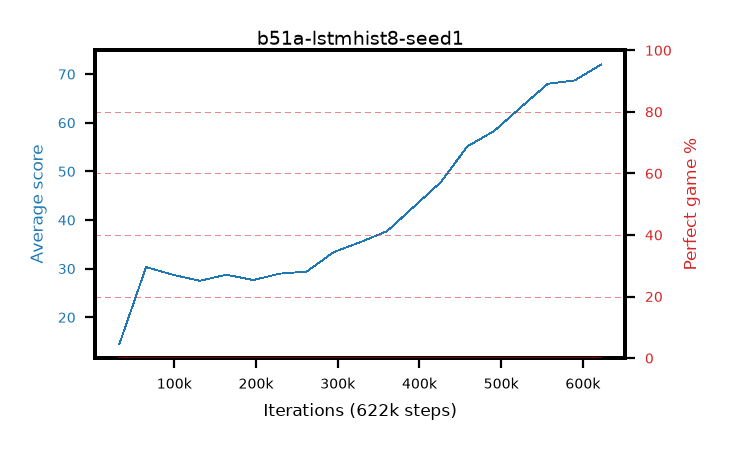

# b51a-lstmhist8-seed1

step **622,592** · 19 evals · trailing **42.02** · peak **42.02** @622,592 · sef **0.0** · best30 **0.0** @622,592

## Config

| | |
|---|---|
| algo | ppo |
| collect_envs | 128 |
| discount | 0.99 |
| eval_interval | 32768 |
| eval_queue | True |
| eval_queue_depth | 16 |
| eval_workers | 8 |
| fc_layers | (320,) |
| graph_eval_episodes | 100 |
| init_from | None |
| max_steps | 100007936 |
| min_checkpoint_score | 40.0 |
| ppo_adam_epsilon | 1e-07 |
| ppo_anneal_fraction | 0.5 |
| ppo_clip | 0.2 |
| ppo_clip_final | None |
| ppo_discount_final | 0.999 |
| ppo_entropy_coef | 0.01 |
| ppo_entropy_coef_final | 0.001 |
| ppo_epochs | 4 |
| ppo_gae_lambda | 0.95 |
| ppo_gae_lambda_final | 0.999 |
| ppo_gradient_clipping | 0.5 |
| ppo_horizon | 16.8 |
| ppo_horizon_final | 500.3 |
| ppo_learning_rate | 0.00025 |
| ppo_learning_rate_final | None |
| ppo_minibatch | 512 |
| ppo_normalize_adv | True |
| ppo_recurrent | lstm |
| ppo_recurrent_hidden | 128 |
| ppo_rollout | 256 |
| ppo_seq_minibatch | 2 |
| ppo_target_kl | 0.0 |
| ppo_transitions_per_rollout | 32768 |
| ppo_value_loss | huber |
| ppo_vf_coef | 0.5 |
| seed | 1 |
| torch_threads | 1 |

## Evals

| step | avg score | trailing avg | min score | max score | avg reward | perfect % | epsilon |
|---|---|---|---|---|---|---|---|
| 32768 | 14.49 | 14.49 | 0.0 | 31.0 | 9.992 | 0.0 |  |
| 65536 | 30.34 | 22.41 | 0.0 | 54.0 | 25.477 | 0.0 |  |
| 98304 | 28.75 | 24.53 | 3.0 | 65.0 | 23.788 | 0.0 |  |
| ... | ... | ... | ... | ... | ... | ... | ... |
| 262144 | 29.41 | 26.99 | 14.0 | 58.0 | 24.366 | 0.0 |  |
| 294912 | 33.4 | 27.7 | 16.0 | 63.0 | 28.343 | 0.0 |  |
| 327680 | 35.45 | 28.48 | 2.0 | 75.0 | 30.424 | 0.0 |  |
| 360448 | 37.72 | 29.32 | 14.0 | 82.0 | 32.683 | 0.0 |  |
| 393216 | 42.74 | 30.44 | 16.0 | 78.0 | 37.667 | 0.0 |  |
| 425984 | 47.77 | 31.77 | 10.0 | 89.0 | 42.661 | 0.0 |  |
| 458752 | 55.16 | 33.44 | 12.0 | 88.0 | 50.15 | 0.0 |  |
| 491520 | 58.32 | 35.1 | 20.0 | 86.0 | 53.539 | 0.0 |  |
| 524288 | 63.22 | 36.86 | 2.0 | 89.0 | 58.984 | 0.0 |  |
| 557056 | 68.01 | 40.36 | 36.0 | 92.0 | 63.704 | 0.0 |  |
| 589824 | 68.7 | 38.73 | 22.0 | 86.0 | 64.578 | 0.0 |  |
| 622592 | 72.02 | 42.02 | 34.0 | 89.0 | 68.203 | 0.0 |  |
