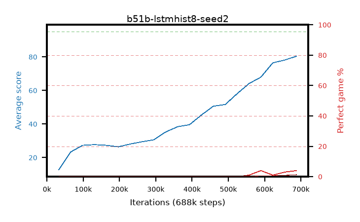

# b51b-lstmhist8-seed2

step **688,128** · 21 evals · trailing **43.76** · peak **43.76** @688,128 · sef **0.0** · best30 **0.0** @688,128

## Config

| | |
|---|---|
| algo | ppo |
| collect_envs | 128 |
| discount | 0.99 |
| eval_interval | 32768 |
| eval_queue | True |
| eval_queue_depth | 16 |
| eval_workers | 8 |
| fc_layers | (320,) |
| graph_eval_episodes | 100 |
| init_from | None |
| max_steps | 100007936 |
| min_checkpoint_score | 40.0 |
| ppo_adam_epsilon | 1e-07 |
| ppo_anneal_fraction | 0.5 |
| ppo_clip | 0.2 |
| ppo_clip_final | None |
| ppo_discount_final | 0.999 |
| ppo_entropy_coef | 0.01 |
| ppo_entropy_coef_final | 0.001 |
| ppo_epochs | 4 |
| ppo_gae_lambda | 0.95 |
| ppo_gae_lambda_final | 0.999 |
| ppo_gradient_clipping | 0.5 |
| ppo_horizon | 16.8 |
| ppo_horizon_final | 500.3 |
| ppo_learning_rate | 0.00025 |
| ppo_learning_rate_final | None |
| ppo_minibatch | 512 |
| ppo_normalize_adv | True |
| ppo_recurrent | lstm |
| ppo_recurrent_hidden | 128 |
| ppo_rollout | 256 |
| ppo_seq_minibatch | 2 |
| ppo_target_kl | 0.0 |
| ppo_transitions_per_rollout | 32768 |
| ppo_value_loss | huber |
| ppo_vf_coef | 0.5 |
| seed | 2 |
| torch_threads | 1 |

## Evals

| step | avg score | trailing avg | min score | max score | avg reward | perfect % | epsilon |
|---|---|---|---|---|---|---|---|
| 32768 | 12.73 | 12.73 | 2.0 | 31.0 | 7.918 | 0.0 |  |
| 65536 | 23.35 | 18.04 | 3.0 | 44.0 | 18.697 | 0.0 |  |
| 98304 | 27.29 | 21.12 | 10.0 | 51.0 | 22.339 | 0.0 |  |
| ... | ... | ... | ... | ... | ... | ... | ... |
| 327680 | 35.3 | 26.82 | 16.0 | 65.0 | 30.235 | 0.0 |  |
| 360448 | 38.4 | 27.87 | 15.0 | 70.0 | 33.321 | 0.0 |  |
| 393216 | 39.62 | 28.85 | 14.0 | 71.0 | 34.533 | 0.0 |  |
| 425984 | 45.39 | 30.12 | 18.0 | 80.0 | 40.267 | 0.0 |  |
| 458752 | 50.62 | 31.59 | 22.0 | 82.0 | 45.454 | 0.0 |  |
| 491520 | 51.61 | 32.92 | 14.0 | 82.0 | 46.777 | 0.0 |  |
| 524288 | 58.06 | 34.49 | 18.0 | 93.0 | 53.344 | 0.0 |  |
| 557056 | 64.1 | 36.24 | 26.0 | 95.0 | 60.846 | 1.0 |  |
| 589824 | 67.92 | 38.0 | 21.0 | 95.0 | 67.692 | 4.0 |  |
| 622592 | 76.45 | 40.02 | 29.0 | 95.0 | 73.728 | 1.0 |  |
| 655360 | 78.11 | 41.92 | 35.0 | 95.0 | 77.756 | 3.0 |  |
| 688128 | 80.44 | 43.76 | 34.0 | 95.0 | 81.557 | 4.0 |  |
