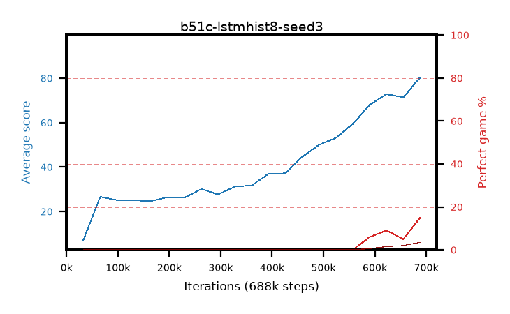

# b51c-lstmhist8-seed3

step **688,128** · 21 evals · trailing **40.75** · peak **40.75** @688,128 · sef **0.0** · best30 **0.0** @688,128

## Config

| | |
|---|---|
| algo | ppo |
| collect_envs | 128 |
| discount | 0.99 |
| eval_interval | 32768 |
| eval_queue | True |
| eval_queue_depth | 16 |
| eval_workers | 8 |
| fc_layers | (320,) |
| graph_eval_episodes | 100 |
| init_from | None |
| max_steps | 100007936 |
| min_checkpoint_score | 40.0 |
| ppo_adam_epsilon | 1e-07 |
| ppo_anneal_fraction | 0.5 |
| ppo_clip | 0.2 |
| ppo_clip_final | None |
| ppo_discount_final | 0.999 |
| ppo_entropy_coef | 0.01 |
| ppo_entropy_coef_final | 0.001 |
| ppo_epochs | 4 |
| ppo_gae_lambda | 0.95 |
| ppo_gae_lambda_final | 0.999 |
| ppo_gradient_clipping | 0.5 |
| ppo_horizon | 16.8 |
| ppo_horizon_final | 500.3 |
| ppo_learning_rate | 0.00025 |
| ppo_learning_rate_final | None |
| ppo_minibatch | 512 |
| ppo_normalize_adv | True |
| ppo_recurrent | lstm |
| ppo_recurrent_hidden | 128 |
| ppo_rollout | 256 |
| ppo_seq_minibatch | 2 |
| ppo_target_kl | 0.0 |
| ppo_transitions_per_rollout | 32768 |
| ppo_value_loss | huber |
| ppo_vf_coef | 0.5 |
| seed | 3 |
| torch_threads | 1 |

## Evals

| step | avg score | trailing avg | min score | max score | avg reward | perfect % | epsilon |
|---|---|---|---|---|---|---|---|
| 32768 | 7.11 | 7.11 | 0.0 | 30.0 | 4.09 | 0.0 |  |
| 65536 | 26.6 | 16.86 | 2.0 | 46.0 | 21.677 | 0.0 |  |
| 98304 | 25.11 | 19.61 | 3.0 | 42.0 | 20.166 | 0.0 |  |
| ... | ... | ... | ... | ... | ... | ... | ... |
| 327680 | 31.17 | 25.0 | 13.0 | 67.0 | 26.128 | 0.0 |  |
| 360448 | 31.73 | 25.61 | 10.0 | 56.0 | 26.683 | 0.0 |  |
| 393216 | 36.96 | 26.56 | 13.0 | 68.0 | 31.891 | 0.0 |  |
| 425984 | 37.2 | 27.38 | 19.0 | 74.0 | 32.124 | 0.0 |  |
| 458752 | 44.61 | 28.61 | 5.0 | 76.0 | 39.786 | 0.0 |  |
| 491520 | 50.05 | 30.04 | 11.0 | 90.0 | 45.088 | 0.0 |  |
| 524288 | 53.16 | 31.48 | 21.0 | 88.0 | 48.435 | 0.0 |  |
| 557056 | 59.41 | 33.12 | 21.0 | 88.0 | 54.783 | 0.0 |  |
| 589824 | 67.94 | 35.06 | 30.0 | 95.0 | 70.214 | 6.0 |  |
| 622592 | 72.83 | 37.05 | 23.0 | 95.0 | 78.889 | 9.0 |  |
| 655360 | 71.42 | 38.77 | 5.0 | 95.0 | 73.36 | 5.0 |  |
| 688128 | 80.34 | 40.75 | 28.0 | 95.0 | 92.595 | 15.0 |  |
