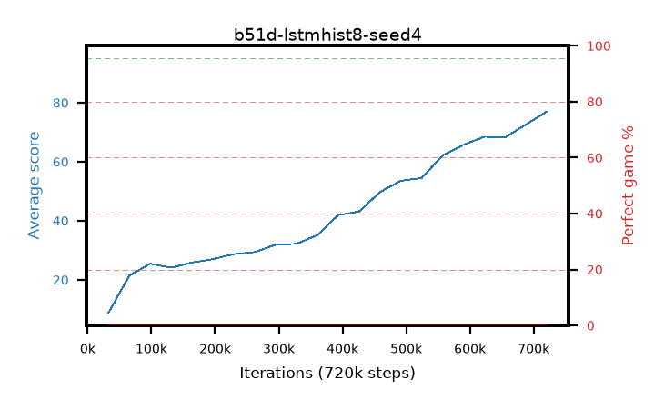

# b51d-lstmhist8-seed4

step **720,896** · 21 evals · trailing **41.64** · peak **41.64** @720,896 · sef **0.0** · best30 **0.0** @720,896

## Config

| | |
|---|---|
| algo | ppo |
| collect_envs | 128 |
| discount | 0.99 |
| eval_interval | 32768 |
| eval_queue | True |
| eval_queue_depth | 16 |
| eval_workers | 8 |
| fc_layers | (320,) |
| graph_eval_episodes | 100 |
| init_from | None |
| max_steps | 100007936 |
| min_checkpoint_score | 40.0 |
| ppo_adam_epsilon | 1e-07 |
| ppo_anneal_fraction | 0.5 |
| ppo_clip | 0.2 |
| ppo_clip_final | None |
| ppo_discount_final | 0.999 |
| ppo_entropy_coef | 0.01 |
| ppo_entropy_coef_final | 0.001 |
| ppo_epochs | 4 |
| ppo_gae_lambda | 0.95 |
| ppo_gae_lambda_final | 0.999 |
| ppo_gradient_clipping | 0.5 |
| ppo_horizon | 16.8 |
| ppo_horizon_final | 500.3 |
| ppo_learning_rate | 0.00025 |
| ppo_learning_rate_final | None |
| ppo_minibatch | 512 |
| ppo_normalize_adv | True |
| ppo_recurrent | lstm |
| ppo_recurrent_hidden | 128 |
| ppo_rollout | 256 |
| ppo_seq_minibatch | 2 |
| ppo_target_kl | 0.0 |
| ppo_transitions_per_rollout | 32768 |
| ppo_value_loss | huber |
| ppo_vf_coef | 0.5 |
| seed | 4 |
| torch_threads | 1 |

## Evals

| step | avg score | trailing avg | min score | max score | avg reward | perfect % | epsilon |
|---|---|---|---|---|---|---|---|
| 32768 | 8.83 | 8.83 | 1.0 | 23.0 | 4.067 | 0.0 |  |
| 65536 | 21.46 | 15.14 | 2.0 | 49.0 | 16.56 | 0.0 |  |
| 98304 | 25.43 | 18.57 | 4.0 | 54.0 | 20.398 | 0.0 |  |
| ... | ... | ... | ... | ... | ... | ... | ... |
| 327680 | 32.18 | 25.48 | 9.0 | 58.0 | 27.124 | 0.0 |  |
| 360448 | 35.11 | 26.35 | 8.0 | 68.0 | 30.043 | 0.0 |  |
| 393216 | 41.9 | 27.65 | 14.0 | 72.0 | 36.798 | 0.0 |  |
| 425984 | 43.12 | 28.84 | 20.0 | 68.0 | 38.089 | 0.0 |  |
| 458752 | 49.73 | 30.33 | 19.0 | 79.0 | 44.693 | 0.0 |  |
| 491520 | 53.55 | 31.88 | 18.0 | 85.0 | 48.637 | 0.0 |  |
| 524288 | 54.48 | 33.29 | 18.0 | 81.0 | 49.706 | 0.0 |  |
| 557056 | 62.17 | 34.99 | 22.0 | 86.0 | 57.806 | 0.0 |  |
| 589824 | 65.76 | 36.7 | 11.0 | 86.0 | 61.772 | 0.0 |  |
| 622592 | 68.46 | 38.37 | 18.0 | 88.0 | 65.126 | 0.0 |  |
| 655360 | 68.26 | 39.86 | 17.0 | 87.0 | 64.129 | 0.0 |  |
| 720896 | 77.04 | 41.64 | 13.0 | 92.0 | 74.234 | 0.0 |  |
