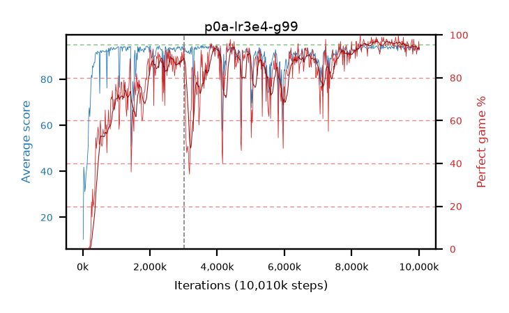

# p0a-lr3e4-g99

step **10,010,624** · 611 evals · trailing **93.45** · peak **94.0** @9,486,336 · sef **69.7** · best30 **96.6** @9,338,880

## Config

| | |
|---|---|
| algo | ppo |
| collect_envs | 128 |
| discount | 0.99 |
| eval_interval | 16384 |
| eval_queue | True |
| eval_queue_depth | 16 |
| eval_workers | 6 |
| fc_layers | (320,) |
| graph_eval_episodes | 100 |
| max_steps | 10000000 |
| min_checkpoint_score | 40.0 |
| ppo_adam_epsilon | 1e-07 |
| ppo_clip | 0.2 |
| ppo_entropy_coef | 0.01 |
| ppo_entropy_coef_final | None |
| ppo_epochs | 4 |
| ppo_gae_lambda | 0.98 |
| ppo_gradient_clipping | 0.5 |
| ppo_horizon | 33.6 |
| ppo_learning_rate | 0.0003 |
| ppo_minibatch | 256 |
| ppo_normalize_adv | True |
| ppo_rollout | 128 |
| ppo_target_kl | 0.0 |
| ppo_transitions_per_rollout | 16384 |
| ppo_value_loss | huber |
| ppo_vf_coef | 0.5 |
| seed | 1 |
| torch_threads | 1 |

## Resumes

Resumed at 3,014,656

## Evals

| step | avg score | trailing avg | min score | max score | avg reward | perfect % | epsilon |
|---|---|---|---|---|---|---|---|
| 16384 | 10.43 | 20.75 | 1.0 | 30.0 | 9.39 | 0.0 |  |
| 32768 | 41.85 | 32.25 | 3.0 | 76.0 | 36.94 | 0.0 |  |
| 49152 | 38.52 | 26.68 | 14.0 | 76.0 | 33.52 | 0.0 |  |
| ... | ... | ... | ... | ... | ... | ... | ... |
| 9830400 | 92.62 | 93.31 | 51.0 | 95.0 | 184.655 | 93.0 |  |
| 9846784 | 93.9 | 93.32 | 30.0 | 95.0 | 190.91 | 98.0 |  |
| 9863168 | 92.5 | 93.77 | 24.0 | 95.0 | 184.49 | 93.0 |  |
| 9879552 | 92.5 | 93.72 | 26.0 | 95.0 | 184.535 | 93.0 |  |
| 9895936 | 93.77 | 93.54 | 46.0 | 95.0 | 187.795 | 95.0 |  |
| 9912320 | 93.63 | 93.49 | 46.0 | 95.0 | 187.655 | 95.0 |  |
| 9928704 | 92.91 | 93.71 | 55.0 | 95.0 | 182.955 | 91.0 |  |
| 9945088 | 93.19 | 93.57 | 26.0 | 95.0 | 185.225 | 93.0 |  |
| 9961472 | 93.17 | 93.51 | 53.0 | 95.0 | 186.2 | 94.0 |  |
| 9977856 | 92.59 | 93.44 | 22.0 | 95.0 | 184.625 | 93.0 |  |
| 9994240 | 94.03 | 93.48 | 26.0 | 95.0 | 190.045 | 97.0 |  |
| 10010624 | 92.87 | 93.45 | 49.0 | 95.0 | 184.905 | 93.0 |  |
