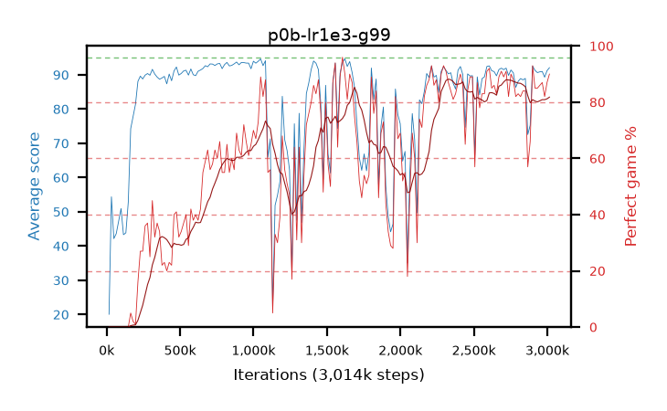

# p0b-lr1e3-g99

step **3,014,656** · 184 evals · trailing **89.14** · peak **92.71** @1,032,192 · sef **36.4** · best30 **85.2** @2,752,512

## Config

| | |
|---|---|
| algo | ppo |
| collect_envs | 128 |
| discount | 0.99 |
| eval_interval | 16384 |
| eval_queue | True |
| eval_queue_depth | 16 |
| eval_workers | 6 |
| fc_layers | (320,) |
| graph_eval_episodes | 100 |
| max_steps | 3000000 |
| min_checkpoint_score | 40.0 |
| ppo_adam_epsilon | 1e-07 |
| ppo_clip | 0.2 |
| ppo_entropy_coef | 0.01 |
| ppo_entropy_coef_final | None |
| ppo_epochs | 4 |
| ppo_gae_lambda | 0.98 |
| ppo_gradient_clipping | 0.5 |
| ppo_horizon | 33.6 |
| ppo_learning_rate | 0.001 |
| ppo_minibatch | 256 |
| ppo_normalize_adv | True |
| ppo_rollout | 128 |
| ppo_target_kl | 0.0 |
| ppo_transitions_per_rollout | 16384 |
| ppo_value_loss | huber |
| ppo_vf_coef | 0.5 |
| seed | 1 |
| torch_threads | 1 |

## Evals

| step | avg score | trailing avg | min score | max score | avg reward | perfect % | epsilon |
|---|---|---|---|---|---|---|---|
| 16384 | 20.06 | 20.06 | 1.0 | 38.0 | 16.77 | 0.0 |  |
| 32768 | 54.38 | 43.19 | 1.0 | 89.0 | 49.92 | 0.0 |  |
| 49152 | 42.15 | 35.28 | 10.0 | 73.0 | 37.195 | 0.0 |  |
| ... | ... | ... | ... | ... | ... | ... | ... |
| 2834432 | 88.54 | 88.62 | 29.0 | 95.0 | 171.62 | 84.0 |  |
| 2850816 | 88.94 | 88.57 | 28.0 | 95.0 | 172.02 | 84.0 |  |
| 2867200 | 72.57 | 88.07 | 23.0 | 95.0 | 128.785 | 57.0 |  |
| 2883584 | 75.28 | 88.24 | 4.0 | 95.0 | 140.45 | 66.0 |  |
| 2899968 | 92.57 | 88.18 | 53.0 | 95.0 | 184.605 | 93.0 |  |
| 2916352 | 91.3 | 88.22 | 44.0 | 95.0 | 175.375 | 85.0 |  |
| 2932736 | 90.65 | 88.17 | 10.0 | 95.0 | 174.725 | 85.0 |  |
| 2949120 | 90.88 | 88.26 | 52.0 | 95.0 | 175.95 | 86.0 |  |
| 2965504 | 90.99 | 88.29 | 43.0 | 95.0 | 177.055 | 87.0 |  |
| 2981888 | 89.31 | 88.25 | 44.0 | 95.0 | 170.4 | 82.0 |  |
| 2998272 | 91.22 | 89.2 | 54.0 | 95.0 | 177.285 | 87.0 |  |
| 3014656 | 92.09 | 89.14 | 58.0 | 95.0 | 181.14 | 90.0 |  |
