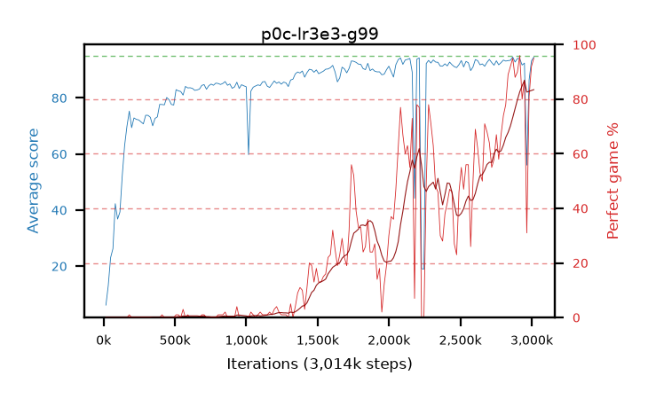

# p0c-lr3e3-g99

step **3,014,656** · 184 evals · trailing **92.53** · peak **92.53** @3,014,656 · sef **6.0** · best30 **69.9** @3,014,656

## Config

| | |
|---|---|
| algo | ppo |
| collect_envs | 128 |
| discount | 0.99 |
| eval_interval | 16384 |
| eval_queue | True |
| eval_queue_depth | 16 |
| eval_workers | 6 |
| fc_layers | (320,) |
| graph_eval_episodes | 100 |
| max_steps | 3000000 |
| min_checkpoint_score | 40.0 |
| ppo_adam_epsilon | 1e-07 |
| ppo_clip | 0.2 |
| ppo_entropy_coef | 0.01 |
| ppo_entropy_coef_final | None |
| ppo_epochs | 4 |
| ppo_gae_lambda | 0.98 |
| ppo_gradient_clipping | 0.5 |
| ppo_horizon | 33.6 |
| ppo_learning_rate | 0.003 |
| ppo_minibatch | 256 |
| ppo_normalize_adv | True |
| ppo_rollout | 128 |
| ppo_target_kl | 0.0 |
| ppo_transitions_per_rollout | 16384 |
| ppo_value_loss | huber |
| ppo_vf_coef | 0.5 |
| seed | 1 |
| torch_threads | 1 |

## Evals

| step | avg score | trailing avg | min score | max score | avg reward | perfect % | epsilon |
|---|---|---|---|---|---|---|---|
| 16384 | 6.13 | 6.13 | 0.0 | 20.0 | 1.4 | 0.0 |  |
| 32768 | 13.1 | 9.62 | 2.0 | 31.0 | 8.1 | 0.0 |  |
| 49152 | 23.05 | 14.09 | 6.0 | 41.0 | 18.05 | 0.0 |  |
| ... | ... | ... | ... | ... | ... | ... | ... |
| 2834432 | 93.31 | 92.33 | 14.0 | 95.0 | 181.365 | 89.0 |  |
| 2850816 | 93.42 | 92.33 | 18.0 | 95.0 | 184.46 | 92.0 |  |
| 2867200 | 94.58 | 92.3 | 80.0 | 95.0 | 188.605 | 95.0 |  |
| 2883584 | 92.79 | 92.21 | 36.0 | 95.0 | 179.85 | 88.0 |  |
| 2899968 | 94.08 | 92.44 | 73.0 | 95.0 | 183.13 | 90.0 |  |
| 2916352 | 94.01 | 92.49 | 24.0 | 95.0 | 189.03 | 96.0 |  |
| 2932736 | 91.72 | 92.42 | 55.0 | 95.0 | 170.82 | 80.0 |  |
| 2949120 | 92.42 | 91.33 | 10.0 | 95.0 | 178.485 | 87.0 |  |
| 2965504 | 56.03 | 91.29 | 15.0 | 95.0 | 83.495 | 31.0 |  |
| 2981888 | 86.41 | 92.33 | 24.0 | 95.0 | 165.92 | 81.0 |  |
| 2998272 | 93.21 | 92.45 | 33.0 | 95.0 | 184.25 | 92.0 |  |
| 3014656 | 94.54 | 92.53 | 76.0 | 95.0 | 188.565 | 95.0 |  |
