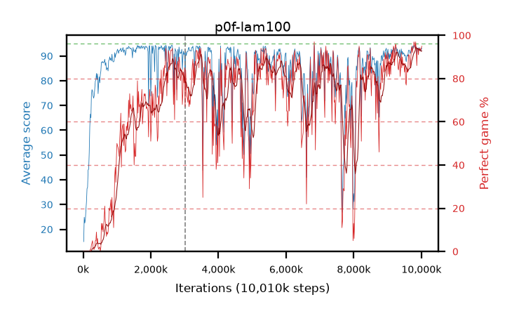

# p0f-lam100

step **10,010,624** · 611 evals · trailing **92.16** · peak **92.99** @1,769,472 · sef **46.3** · best30 **90.8** @10,010,624

## Config

| | |
|---|---|
| algo | ppo |
| collect_envs | 128 |
| discount | 0.99 |
| eval_interval | 16384 |
| eval_queue | True |
| eval_queue_depth | 16 |
| eval_workers | 6 |
| fc_layers | (320,) |
| graph_eval_episodes | 100 |
| max_steps | 10000000 |
| min_checkpoint_score | 40.0 |
| ppo_adam_epsilon | 1e-07 |
| ppo_clip | 0.2 |
| ppo_entropy_coef | 0.01 |
| ppo_entropy_coef_final | None |
| ppo_epochs | 4 |
| ppo_gae_lambda | 1.0 |
| ppo_gradient_clipping | 0.5 |
| ppo_horizon | 100.0 |
| ppo_learning_rate | 0.0003 |
| ppo_minibatch | 256 |
| ppo_normalize_adv | True |
| ppo_rollout | 128 |
| ppo_target_kl | 0.0 |
| ppo_transitions_per_rollout | 16384 |
| ppo_value_loss | huber |
| ppo_vf_coef | 0.5 |
| seed | 1 |
| torch_threads | 1 |

## Resumes

Resumed at 3,014,656

## Evals

| step | avg score | trailing avg | min score | max score | avg reward | perfect % | epsilon |
|---|---|---|---|---|---|---|---|
| 16384 | 15.01 | 15.01 | 5.0 | 34.0 | 10.01 | 0.0 |  |
| 32768 | 24.86 | 21.55 | 2.0 | 50.0 | 19.95 | 0.0 |  |
| 49152 | 22.55 | 18.78 | 3.0 | 41.0 | 17.64 | 0.0 |  |
| ... | ... | ... | ... | ... | ... | ... | ... |
| 9830400 | 94.13 | 91.41 | 64.0 | 95.0 | 190.145 | 97.0 |  |
| 9846784 | 92.33 | 91.5 | 24.0 | 95.0 | 184.365 | 93.0 |  |
| 9863168 | 90.7 | 91.38 | 54.0 | 95.0 | 175.77 | 86.0 |  |
| 9879552 | 93.19 | 91.44 | 59.0 | 95.0 | 186.22 | 94.0 |  |
| 9895936 | 93.04 | 91.46 | 41.0 | 95.0 | 186.025 | 94.0 |  |
| 9912320 | 91.83 | 91.8 | 14.0 | 95.0 | 181.83 | 91.0 |  |
| 9928704 | 93.4 | 91.68 | 44.0 | 95.0 | 186.43 | 94.0 |  |
| 9945088 | 92.79 | 91.68 | 53.0 | 95.0 | 184.825 | 93.0 |  |
| 9961472 | 92.43 | 91.98 | 14.0 | 95.0 | 185.46 | 94.0 |  |
| 9977856 | 92.07 | 91.94 | 12.0 | 95.0 | 184.105 | 93.0 |  |
| 9994240 | 92.51 | 92.07 | 14.0 | 95.0 | 185.54 | 94.0 |  |
| 10010624 | 93.17 | 92.16 | 42.0 | 95.0 | 187.15 | 95.0 |  |
