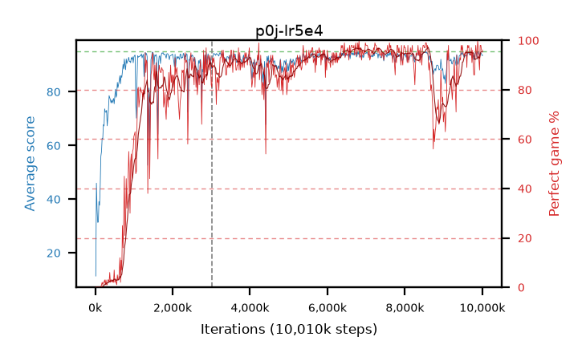

# p0j-lr5e4

step **10,010,624** · 611 evals · trailing **93.4** · peak **93.87** @7,012,352 · sef **78.4** · best30 **96.5** @7,045,120

## Config

| | |
|---|---|
| algo | ppo |
| collect_envs | 128 |
| discount | 0.99 |
| eval_interval | 16384 |
| eval_queue | True |
| eval_queue_depth | 16 |
| eval_workers | 6 |
| fc_layers | (320,) |
| graph_eval_episodes | 100 |
| max_steps | 10000000 |
| min_checkpoint_score | 40.0 |
| ppo_adam_epsilon | 1e-07 |
| ppo_clip | 0.2 |
| ppo_entropy_coef | 0.01 |
| ppo_entropy_coef_final | None |
| ppo_epochs | 4 |
| ppo_gae_lambda | 0.98 |
| ppo_gradient_clipping | 0.5 |
| ppo_horizon | 33.6 |
| ppo_learning_rate | 0.0005 |
| ppo_minibatch | 256 |
| ppo_normalize_adv | True |
| ppo_rollout | 128 |
| ppo_target_kl | 0.0 |
| ppo_transitions_per_rollout | 16384 |
| ppo_value_loss | huber |
| ppo_vf_coef | 0.5 |
| seed | 1 |
| torch_threads | 1 |

## Resumes

Resumed at 3,014,656

## Evals

| step | avg score | trailing avg | min score | max score | avg reward | perfect % | epsilon |
|---|---|---|---|---|---|---|---|
| 16384 | 11.36 | 11.36 | 0.0 | 31.0 | 10.275 | 0.0 |  |
| 32768 | 45.99 | 32.62 | 19.0 | 80.0 | 41.08 | 0.0 |  |
| 49152 | 36.45 | 27.66 | 4.0 | 63.0 | 31.495 | 0.0 |  |
| ... | ... | ... | ... | ... | ... | ... | ... |
| 9830400 | 94.78 | 93.72 | 76.0 | 95.0 | 191.79 | 98.0 |  |
| 9846784 | 94.16 | 93.68 | 68.0 | 95.0 | 188.185 | 95.0 |  |
| 9863168 | 92.55 | 93.41 | 26.0 | 95.0 | 184.585 | 93.0 |  |
| 9879552 | 95.0 | 93.77 | 95.0 | 95.0 | 194.0 | 100.0 |  |
| 9895936 | 94.49 | 93.8 | 76.0 | 95.0 | 190.505 | 97.0 |  |
| 9912320 | 94.2 | 93.78 | 77.0 | 95.0 | 185.24 | 92.0 |  |
| 9928704 | 93.26 | 93.76 | 68.0 | 95.0 | 180.32 | 88.0 |  |
| 9945088 | 94.63 | 93.76 | 73.0 | 95.0 | 191.64 | 98.0 |  |
| 9961472 | 94.39 | 93.8 | 58.0 | 95.0 | 191.4 | 98.0 |  |
| 9977856 | 94.23 | 93.76 | 60.0 | 95.0 | 189.25 | 96.0 |  |
| 9994240 | 93.52 | 93.46 | 48.0 | 95.0 | 188.54 | 96.0 |  |
| 10010624 | 93.6 | 93.4 | 53.0 | 95.0 | 188.62 | 96.0 |  |
