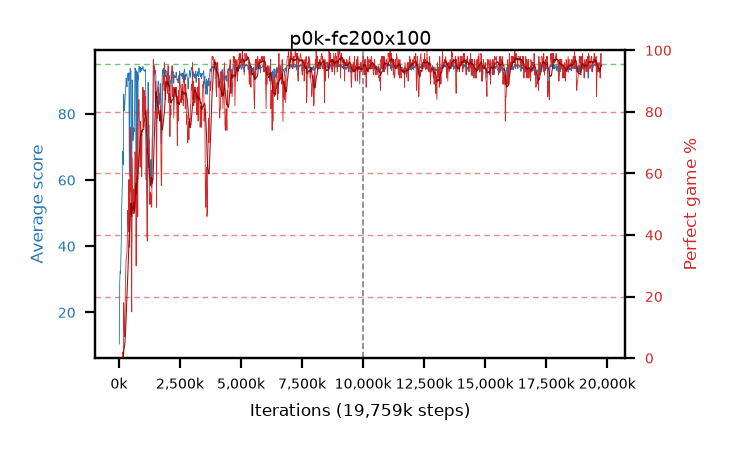

# p0k-fc200x100

step **19,759,104** · 1206 evals · trailing **94.12** · peak **94.52** @14,073,856 · sef **89.2** · best30 **97.1** @7,487,488

## Config

| | |
|---|---|
| algo | ppo |
| collect_envs | 128 |
| discount | 0.99 |
| eval_interval | 16384 |
| eval_queue | True |
| eval_queue_depth | 16 |
| eval_workers | 6 |
| fc_layers | (200, 100) |
| graph_eval_episodes | 100 |
| max_steps | 470000000 |
| min_checkpoint_score | 40.0 |
| ppo_adam_epsilon | 1e-07 |
| ppo_clip | 0.2 |
| ppo_entropy_coef | 0.01 |
| ppo_entropy_coef_final | None |
| ppo_epochs | 4 |
| ppo_gae_lambda | 0.98 |
| ppo_gradient_clipping | 0.5 |
| ppo_horizon | 33.6 |
| ppo_learning_rate | 0.0003 |
| ppo_minibatch | 256 |
| ppo_normalize_adv | True |
| ppo_rollout | 128 |
| ppo_target_kl | 0.0 |
| ppo_transitions_per_rollout | 16384 |
| ppo_value_loss | huber |
| ppo_vf_coef | 0.5 |
| seed | 1 |
| torch_threads | 1 |

## Resumes

Resumed at 10,010,624

## Evals

| step | avg score | trailing avg | min score | max score | avg reward | perfect % | epsilon |
|---|---|---|---|---|---|---|---|
| 16384 | 10.41 | 10.41 | 0.0 | 24.0 | 6.355 | 0.0 |  |
| 32768 | 29.35 | 23.87 | 0.0 | 58.0 | 24.98 | 0.0 |  |
| 49152 | 32.38 | 26.0 | 1.0 | 76.0 | 27.605 | 0.0 |  |
| ... | ... | ... | ... | ... | ... | ... | ... |
| 19578880 | 93.93 | 94.09 | 72.0 | 95.0 | 183.93 | 91.0 |  |
| 19595264 | 94.55 | 94.12 | 80.0 | 95.0 | 188.575 | 95.0 |  |
| 19611648 | 94.7 | 94.16 | 85.0 | 95.0 | 189.675 | 96.0 |  |
| 19628032 | 93.71 | 94.14 | 16.0 | 95.0 | 185.7 | 93.0 |  |
| 19644416 | 93.31 | 94.12 | 28.0 | 95.0 | 187.245 | 95.0 |  |
| 19660800 | 93.86 | 94.17 | 30.0 | 95.0 | 188.835 | 96.0 |  |
| 19677184 | 93.34 | 94.15 | 28.0 | 95.0 | 188.27 | 96.0 |  |
| 19693568 | 92.47 | 94.21 | 20.0 | 95.0 | 186.36 | 95.0 |  |
| 19709952 | 92.61 | 94.13 | 26.0 | 95.0 | 182.52 | 91.0 |  |
| 19726336 | 94.09 | 94.16 | 64.0 | 95.0 | 188.115 | 95.0 |  |
| 19742720 | 94.96 | 94.13 | 91.0 | 95.0 | 192.965 | 99.0 |  |
| 19759104 | 94.38 | 94.12 | 75.0 | 95.0 | 188.405 | 95.0 |  |
