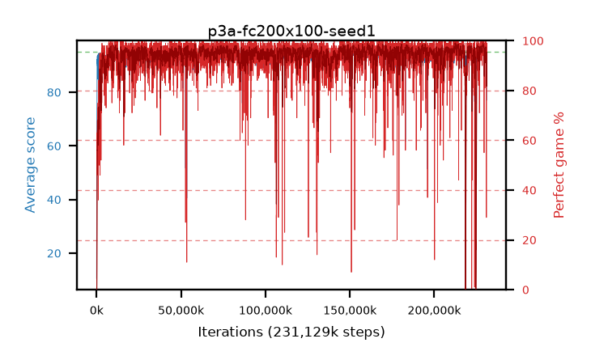

# p3a-fc200x100-seed1

step **231,129,088** · 14103 evals · trailing **93.45** · peak **94.85** @228,704,256 · sef **97.0** · best30 **98.4** @229,146,624

## Config

| | |
|---|---|
| algo | ppo |
| collect_envs | 128 |
| discount | 0.99 |
| eval_interval | 16384 |
| eval_queue | True |
| eval_queue_depth | 16 |
| eval_workers | 6 |
| fc_layers | (200, 100) |
| graph_eval_episodes | 100 |
| max_steps | 400000000 |
| min_checkpoint_score | 40.0 |
| ppo_adam_epsilon | 1e-07 |
| ppo_clip | 0.2 |
| ppo_entropy_coef | 0.01 |
| ppo_entropy_coef_final | None |
| ppo_epochs | 4 |
| ppo_gae_lambda | 0.98 |
| ppo_gradient_clipping | 0.5 |
| ppo_horizon | 33.6 |
| ppo_learning_rate | 0.0003 |
| ppo_minibatch | 256 |
| ppo_normalize_adv | True |
| ppo_rollout | 128 |
| ppo_target_kl | 0.0 |
| ppo_transitions_per_rollout | 16384 |
| ppo_value_loss | huber |
| ppo_vf_coef | 0.5 |
| seed | 1 |
| torch_threads | 1 |

## Evals

| step | avg score | trailing avg | min score | max score | avg reward | perfect % | epsilon |
|---|---|---|---|---|---|---|---|
| 16384 | 10.61 | 10.61 | 0.0 | 22.0 | 6.465 | 0.0 |  |
| 32768 | 32.92 | 26.4 | 8.0 | 58.0 | 28.64 | 0.0 |  |
| 49152 | 35.67 | 23.14 | 8.0 | 64.0 | 30.715 | 0.0 |  |
| ... | ... | ... | ... | ... | ... | ... | ... |
| 230883328 | 76.98 | 93.89 | 23.0 | 95.0 | 102.14 | 29.0 |  |
| 230899712 | 90.35 | 93.78 | 43.0 | 95.0 | 163.35 | 75.0 |  |
| 230916096 | 94.03 | 93.7 | 61.0 | 95.0 | 182.63 | 90.0 |  |
| 230932480 | 94.94 | 93.74 | 89.0 | 95.0 | 192.9 | 99.0 |  |
| 230948864 | 94.73 | 93.77 | 87.0 | 95.0 | 188.53 | 95.0 |  |
| 230965248 | 93.57 | 93.44 | 18.0 | 95.0 | 187.46 | 95.0 |  |
| 231047168 | 94.6 | 93.71 | 84.0 | 95.0 | 185.28 | 92.0 |  |
| 231063552 | 94.88 | 93.78 | 88.0 | 95.0 | 191.8 | 98.0 |  |
| 231079936 | 94.25 | 93.75 | 74.0 | 95.0 | 185.02 | 92.0 |  |
| 231096320 | 94.78 | 93.77 | 85.0 | 95.0 | 190.66 | 97.0 |  |
| 231112704 | 94.69 | 93.76 | 73.0 | 95.0 | 189.53 | 96.0 |  |
| 231129088 | 94.87 | 93.45 | 82.0 | 95.0 | 192.83 | 99.0 |  |
