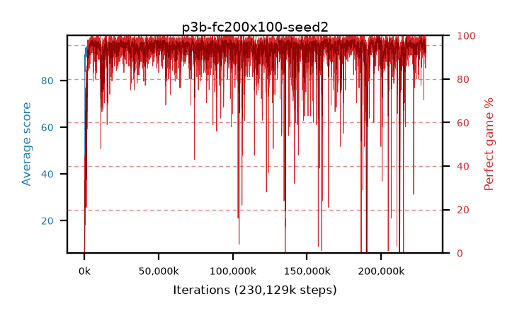

# p3b-fc200x100-seed2

step **230,129,664** · 14040 evals · trailing **93.64** · peak **94.73** @197,050,368 · sef **95.5** · best30 **98.4** @197,574,656

## Config

| | |
|---|---|
| algo | ppo |
| collect_envs | 128 |
| discount | 0.99 |
| eval_interval | 16384 |
| eval_queue | True |
| eval_queue_depth | 16 |
| eval_workers | 6 |
| fc_layers | (200, 100) |
| graph_eval_episodes | 100 |
| max_steps | 400000000 |
| min_checkpoint_score | 40.0 |
| ppo_adam_epsilon | 1e-07 |
| ppo_clip | 0.2 |
| ppo_entropy_coef | 0.01 |
| ppo_entropy_coef_final | None |
| ppo_epochs | 4 |
| ppo_gae_lambda | 0.98 |
| ppo_gradient_clipping | 0.5 |
| ppo_horizon | 33.6 |
| ppo_learning_rate | 0.0003 |
| ppo_minibatch | 256 |
| ppo_normalize_adv | True |
| ppo_rollout | 128 |
| ppo_target_kl | 0.0 |
| ppo_transitions_per_rollout | 16384 |
| ppo_value_loss | huber |
| ppo_vf_coef | 0.5 |
| seed | 2 |
| torch_threads | 1 |

## Evals

| step | avg score | trailing avg | min score | max score | avg reward | perfect % | epsilon |
|---|---|---|---|---|---|---|---|
| 16384 | 10.36 | 10.36 | 2.0 | 19.0 | 5.36 | 0.0 |  |
| 32768 | 29.46 | 22.72 | 8.0 | 53.0 | 24.46 | 0.0 |  |
| 49152 | 36.41 | 26.14 | 8.0 | 62.0 | 31.41 | 0.0 |  |
| ... | ... | ... | ... | ... | ... | ... | ... |
| 229851136 | 92.66 | 93.57 | 9.0 | 95.0 | 185.555 | 94.0 |  |
| 229867520 | 93.21 | 93.64 | 1.0 | 95.0 | 186.015 | 94.0 |  |
| 229883904 | 92.78 | 93.61 | 11.0 | 95.0 | 176.225 | 85.0 |  |
| 229965824 | 94.31 | 93.57 | 63.0 | 95.0 | 184.99 | 92.0 |  |
| 229982208 | 93.21 | 93.6 | 13.0 | 95.0 | 182.895 | 91.0 |  |
| 229998592 | 93.83 | 93.57 | 11.0 | 95.0 | 188.67 | 96.0 |  |
| 230014976 | 95.0 | 93.58 | 95.0 | 95.0 | 194.0 | 100.0 |  |
| 230031360 | 93.84 | 93.64 | 5.0 | 95.0 | 189.765 | 97.0 |  |
| 230047744 | 94.81 | 93.66 | 77.0 | 95.0 | 191.73 | 98.0 |  |
| 230064128 | 95.0 | 93.64 | 95.0 | 95.0 | 194.0 | 100.0 |  |
| 230096896 | 93.87 | 93.64 | 1.0 | 95.0 | 188.755 | 96.0 |  |
| 230129664 | 94.73 | 93.64 | 79.0 | 95.0 | 191.65 | 98.0 |  |
