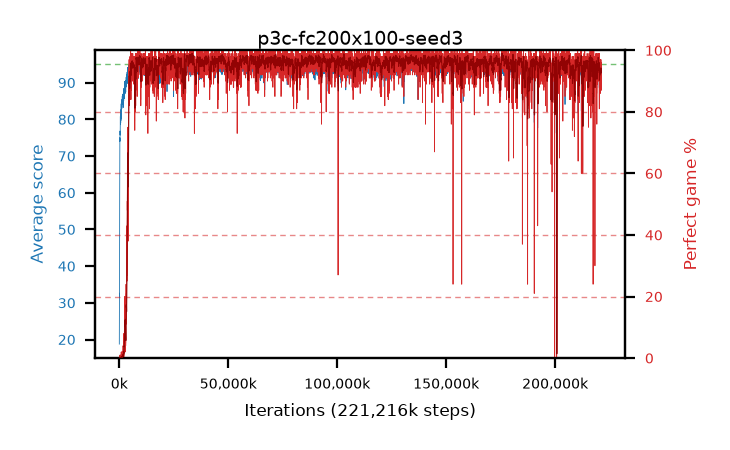

# p3c-fc200x100-seed3

step **221,216,768** · 13498 evals · trailing **93.88** · peak **94.68** @141,967,360 · sef **97.5** · best30 **98.5** @175,865,856

## Config

| | |
|---|---|
| algo | ppo |
| collect_envs | 128 |
| discount | 0.99 |
| eval_interval | 16384 |
| eval_queue | True |
| eval_queue_depth | 16 |
| eval_workers | 6 |
| fc_layers | (200, 100) |
| graph_eval_episodes | 100 |
| max_steps | 400000000 |
| min_checkpoint_score | 40.0 |
| ppo_adam_epsilon | 1e-07 |
| ppo_clip | 0.2 |
| ppo_entropy_coef | 0.01 |
| ppo_entropy_coef_final | None |
| ppo_epochs | 4 |
| ppo_gae_lambda | 0.98 |
| ppo_gradient_clipping | 0.5 |
| ppo_horizon | 33.6 |
| ppo_learning_rate | 0.0003 |
| ppo_minibatch | 256 |
| ppo_normalize_adv | True |
| ppo_rollout | 128 |
| ppo_target_kl | 0.0 |
| ppo_transitions_per_rollout | 16384 |
| ppo_value_loss | huber |
| ppo_vf_coef | 0.5 |
| seed | 3 |
| torch_threads | 1 |

## Evals

| step | avg score | trailing avg | min score | max score | avg reward | perfect % | epsilon |
|---|---|---|---|---|---|---|---|
| 16384 | 18.75 | 18.75 | 2.0 | 35.0 | 13.795 | 0.0 |  |
| 32768 | 31.14 | 27.8 | 9.0 | 53.0 | 26.185 | 0.0 |  |
| 49152 | 30.03 | 24.39 | 15.0 | 47.0 | 25.075 | 0.0 |  |
| ... | ... | ... | ... | ... | ... | ... | ... |
| 220971008 | 94.24 | 93.67 | 81.0 | 95.0 | 184.06 | 91.0 |  |
| 220987392 | 94.65 | 93.8 | 73.0 | 95.0 | 190.62 | 97.0 |  |
| 221003776 | 94.54 | 93.81 | 78.0 | 95.0 | 190.555 | 97.0 |  |
| 221020160 | 94.36 | 93.85 | 71.0 | 95.0 | 189.335 | 96.0 |  |
| 221036544 | 93.54 | 93.86 | 10.0 | 95.0 | 183.405 | 91.0 |  |
| 221118464 | 93.72 | 93.8 | 69.0 | 95.0 | 184.715 | 92.0 |  |
| 221134848 | 94.09 | 93.81 | 78.0 | 95.0 | 185.04 | 92.0 |  |
| 221151232 | 93.67 | 93.84 | 71.0 | 95.0 | 182.63 | 90.0 |  |
| 221167616 | 93.45 | 93.84 | 71.0 | 95.0 | 179.29 | 87.0 |  |
| 221184000 | 94.24 | 93.87 | 75.0 | 95.0 | 188.22 | 95.0 |  |
| 221200384 | 94.39 | 93.86 | 76.0 | 95.0 | 189.365 | 96.0 |  |
| 221216768 | 93.89 | 93.88 | 74.0 | 95.0 | 183.845 | 91.0 |  |
