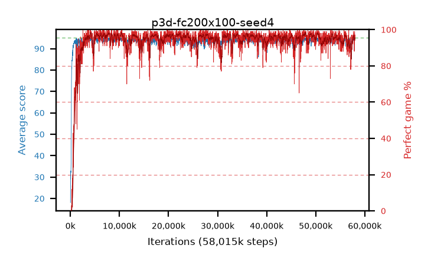

# p3d-fc200x100-seed4

step **58,015,744** · 3540 evals · trailing **94.07** · peak **94.47** @50,593,792 · sef **96.7** · best30 **97.8** @8,028,160

## Config

| | |
|---|---|
| algo | ppo |
| collect_envs | 128 |
| discount | 0.99 |
| eval_interval | 16384 |
| eval_queue | True |
| eval_queue_depth | 16 |
| eval_workers | 6 |
| fc_layers | (200, 100) |
| graph_eval_episodes | 100 |
| max_steps | 400000000 |
| min_checkpoint_score | 40.0 |
| ppo_adam_epsilon | 1e-07 |
| ppo_clip | 0.2 |
| ppo_entropy_coef | 0.01 |
| ppo_entropy_coef_final | None |
| ppo_epochs | 4 |
| ppo_gae_lambda | 0.98 |
| ppo_gradient_clipping | 0.5 |
| ppo_horizon | 33.6 |
| ppo_learning_rate | 0.0003 |
| ppo_minibatch | 256 |
| ppo_normalize_adv | True |
| ppo_rollout | 128 |
| ppo_target_kl | 0.0 |
| ppo_transitions_per_rollout | 16384 |
| ppo_value_loss | huber |
| ppo_vf_coef | 0.5 |
| seed | 4 |
| torch_threads | 1 |

## Evals

| step | avg score | trailing avg | min score | max score | avg reward | perfect % | epsilon |
|---|---|---|---|---|---|---|---|
| 16384 | 18.06 | 18.06 | 2.0 | 36.0 | 13.285 | 0.0 |  |
| 32768 | 32.44 | 26.48 | 10.0 | 57.0 | 27.44 | 0.0 |  |
| 49152 | 28.95 | 23.5 | 7.0 | 50.0 | 24.13 | 0.0 |  |
| ... | ... | ... | ... | ... | ... | ... | ... |
| 57819136 | 93.71 | 94.18 | 7.0 | 95.0 | 185.7 | 93.0 |  |
| 57835520 | 94.13 | 94.14 | 60.0 | 95.0 | 188.065 | 95.0 |  |
| 57851904 | 94.54 | 94.04 | 74.0 | 95.0 | 189.56 | 96.0 |  |
| 57868288 | 89.08 | 94.08 | 28.0 | 95.0 | 175.69 | 88.0 |  |
| 57884672 | 93.94 | 94.14 | 6.0 | 95.0 | 190.95 | 98.0 |  |
| 57901056 | 92.39 | 94.03 | 18.0 | 95.0 | 183.295 | 92.0 |  |
| 57917440 | 94.12 | 94.02 | 12.0 | 95.0 | 191.13 | 98.0 |  |
| 57933824 | 94.97 | 94.1 | 92.0 | 95.0 | 192.975 | 99.0 |  |
| 57966592 | 94.65 | 94.26 | 81.0 | 95.0 | 190.665 | 97.0 |  |
| 57982976 | 94.28 | 94.21 | 63.0 | 95.0 | 189.3 | 96.0 |  |
| 57999360 | 94.57 | 94.16 | 74.0 | 95.0 | 190.54 | 97.0 |  |
| 58015744 | 94.62 | 94.07 | 82.0 | 95.0 | 187.56 | 94.0 |  |
