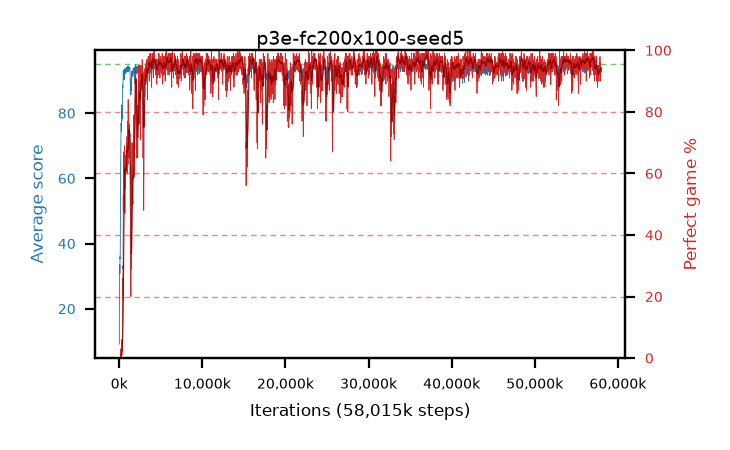

# p3e-fc200x100-seed5

step **58,015,744** · 3539 evals · trailing **93.56** · peak **94.5** @56,999,936 · sef **94.5** · best30 **97.8** @37,126,144

## Config

| | |
|---|---|
| algo | ppo |
| collect_envs | 128 |
| discount | 0.99 |
| eval_interval | 16384 |
| eval_queue | True |
| eval_queue_depth | 16 |
| eval_workers | 6 |
| fc_layers | (200, 100) |
| graph_eval_episodes | 100 |
| max_steps | 400000000 |
| min_checkpoint_score | 40.0 |
| ppo_adam_epsilon | 1e-07 |
| ppo_clip | 0.2 |
| ppo_entropy_coef | 0.01 |
| ppo_entropy_coef_final | None |
| ppo_epochs | 4 |
| ppo_gae_lambda | 0.98 |
| ppo_gradient_clipping | 0.5 |
| ppo_horizon | 33.6 |
| ppo_learning_rate | 0.0003 |
| ppo_minibatch | 256 |
| ppo_normalize_adv | True |
| ppo_rollout | 128 |
| ppo_target_kl | 0.0 |
| ppo_transitions_per_rollout | 16384 |
| ppo_value_loss | huber |
| ppo_vf_coef | 0.5 |
| seed | 5 |
| torch_threads | 1 |

## Evals

| step | avg score | trailing avg | min score | max score | avg reward | perfect % | epsilon |
|---|---|---|---|---|---|---|---|
| 16384 | 9.14 | 9.14 | 1.0 | 27.0 | 7.2 | 0.0 |  |
| 32768 | 29.71 | 19.43 | 7.0 | 52.0 | 24.71 | 0.0 |  |
| 49152 | 30.96 | 23.27 | 13.0 | 54.0 | 25.96 | 0.0 |  |
| ... | ... | ... | ... | ... | ... | ... | ... |
| 57802752 | 93.98 | 93.57 | 34.0 | 95.0 | 187.01 | 94.0 |  |
| 57819136 | 93.44 | 93.53 | 18.0 | 95.0 | 185.475 | 93.0 |  |
| 57835520 | 94.26 | 93.52 | 60.0 | 95.0 | 189.145 | 96.0 |  |
| 57851904 | 94.59 | 93.61 | 60.0 | 95.0 | 191.6 | 98.0 |  |
| 57868288 | 94.17 | 93.53 | 68.0 | 95.0 | 185.21 | 92.0 |  |
| 57884672 | 93.29 | 93.58 | 32.0 | 95.0 | 182.34 | 90.0 |  |
| 57901056 | 94.67 | 93.64 | 80.0 | 95.0 | 189.69 | 96.0 |  |
| 57917440 | 93.89 | 93.63 | 30.0 | 95.0 | 188.91 | 96.0 |  |
| 57933824 | 94.28 | 93.58 | 71.0 | 95.0 | 186.225 | 93.0 |  |
| 57966592 | 93.02 | 93.51 | 8.0 | 95.0 | 186.05 | 94.0 |  |
| 57982976 | 92.59 | 93.56 | 1.0 | 95.0 | 184.625 | 93.0 |  |
| 58015744 | 93.96 | 93.56 | 77.0 | 95.0 | 185.995 | 93.0 |  |
